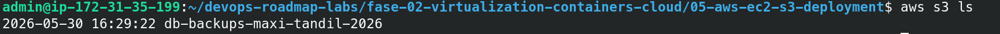

# Fase 5: Cloud Computing (AWS Free Tier)

Este laboratorio contiene la configuración inicial, despliegue y automatización de infraestructura en Amazon Web Services (AWS).

## Misión 1: Seguridad Base (IAM) y Gestión de Costos

Para asegurar la cuenta y cumplir con las buenas prácticas de AWS, se realizaron las siguientes acciones:

- [x] **Segurización de Cuenta Root:** Se activó la autenticación multifactor (MFA) en la cuenta principal.
- [x] **Alerta de Presupuesto (Billing Alarm):** Se configuró una alerta en *AWS Budgets* automatizada para recibir un correo electrónico si el gasto proyectado o real supera los **$1 USD**.
- [x] **Usuario IAM Administrador:** Se creó el usuario operativo `maxi-admin` con la política `AdministratorAccess` y MFA obligatorio. La cuenta Root ya no se utiliza para el despliegue diario.

### Evidencias de Configuración

## Misión 2: Redes y Firewall (VPC y Security Groups)

Se configuró la seguridad a nivel de red para la instancia pública:
- [x] **Security Group (Firewall Stateful):** Se creó el grupo `web-docker-sg` permitiendo únicamente tráfico SSH (puerto 22) desde una IP administrativa específica y tráfico HTTP (puerto 80) desde cualquier origen (`0.0.0.0/0`).

## Misión 3: Cómputo (EC2 y Docker)

Se aprovisionó un servidor Linux en la nube para alojar la aplicación y su base de datos:
- [x] **Instancia EC2:** Se desplegó una instancia `t3.micro` con Debian.
- [x] **Preparación del Entorno:** Se instaló Docker y Git mediante comandos de terminal (SSH).
- [x] **Despliegue inicial:** Se clonó el repositorio y se ejecutó el contenedor de la Fase 4, exponiendo el servicio al mundo.
- [x] **Orquestación con Docker Compose:** Se migró el contenedor individual hacia un despliegue multi-contenedor. La aplicación Python ahora se comunica exitosamente con una base de datos PostgreSQL en la misma red de Docker, persistiendo los datos mediante volúmenes.

## Misión 4: Almacenamiento y Automatización (S3 + Cron)

Se implementó una estrategia de respaldos (backups) automatizados y seguros para la base de datos de producción, enviando los datos fuera del servidor EC2 hacia Amazon S3.

- [x] **Bucket S3 (Almacenamiento Seguro):** Se creó el bucket `db-backups-maxi-tandil-2026` con el acceso público completamente bloqueado para garantizar la privacidad de los datos.
- [x] **Seguridad sin Contraseñas (IAM Roles):** Se le asignó al servidor EC2 un Rol de IAM (`ec2-s3-backup-role`) para que pueda autenticarse y escribir en S3 automáticamente, evitando dejar credenciales (Access Keys) expuestas en el código o en el sistema operativo.
- [x] **Script de Backup:** Se desarrolló un script en Bash (`backup.sh`) dentro del servidor que extrae los datos del contenedor PostgreSQL con `pg_dump`, los comprime con `gzip` y los envía a la nube usando AWS CLI.
- [x] **Automatización (Cron):** Se programó una tarea en el `crontab` de Linux para ejecutar el script de backup todos los días a las 3:00 AM, guardando un registro de eventos en `/tmp/backup_cron.log`.

