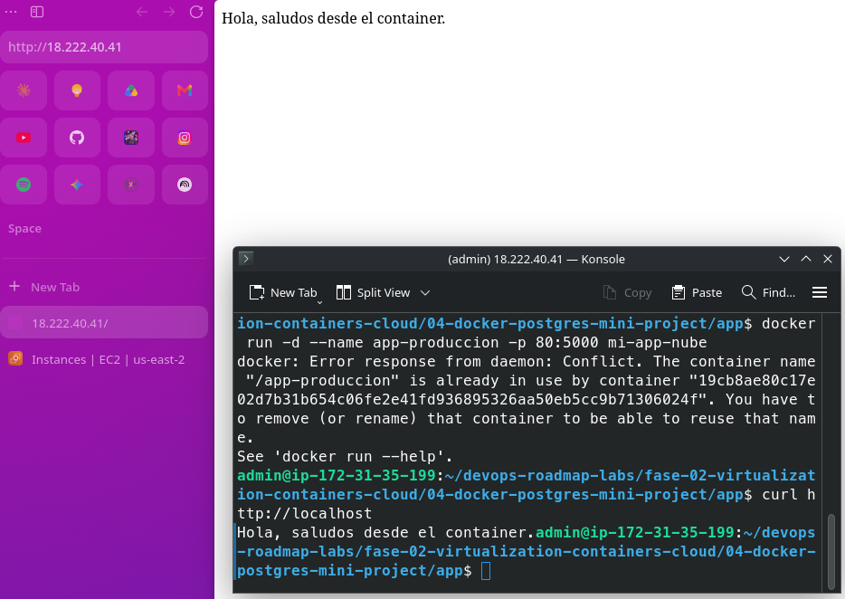
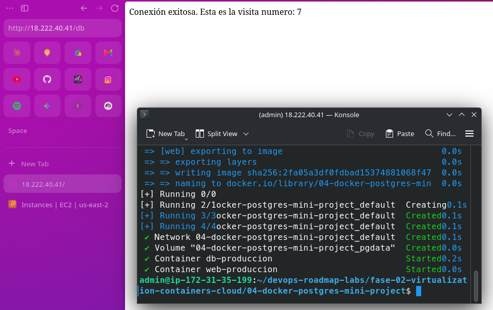

# Fase 5: Cloud Computing (AWS Free Tier)

Este laboratorio contiene la configuración inicial, despliegue y automatización de infraestructura en Amazon Web Services (AWS).

## Misión 1: Seguridad Base (IAM) y Gestión de Costos

Para asegurar la cuenta y cumplir con las buenas prácticas de AWS, se realizaron las siguientes acciones:

- [x] **Segurización de Cuenta Root:** Se activó la autenticación multifactor (MFA) en la cuenta principal.
- [x] **Alerta de Presupuesto (Billing Alarm):** Se configuró una alerta en *AWS Budgets* automatizada para recibir un correo electrónico si el gasto proyectado o real supera los **$1 USD**.
- [x] **Usuario IAM Administrador:** Se creó el usuario operativo `maxi-admin` con la política `AdministratorAccess` y MFA obligatorio. La cuenta Root ya no se utiliza para el despliegue diario.

### Evidencias de Configuración

## Misión 2: Redes y Firewall (VPC y Security Groups)

Se configuró la seguridad a nivel de red para la instancia pública:
- [x] **Security Group (Firewall Stateful):** Se creó el grupo `web-docker-sg` permitiendo únicamente tráfico SSH (puerto 22) desde una IP administrativa específica y tráfico HTTP (puerto 80/8000) desde cualquier origen (`0.0.0.0/0`).

## Misión 3: Cómputo (EC2 y Docker)
Se aprovisionó un servidor Linux en la nube para alojar la aplicación:
- [x] **Instancia EC2:** Se desplegó una instancia `t3.micro` con Debian.
- [x] **Preparación del Entorno:** Se instaló Docker y Git mediante comandos de terminal (SSH).
- [x] **Despliegue:** Se clonó el repositorio y se ejecutó el contenedor de la Fase 4, exponiendo el servicio al mundo a través del puerto 80.

- [x] **Orquestación con Docker Compose:** Se migró el contenedor individual hacia un despliegue multi-contenedor. La aplicación Python ahora se comunica exitosamente con una base de datos PostgreSQL en la misma red de Docker, persistiendo los datos mediante volúmenes.

