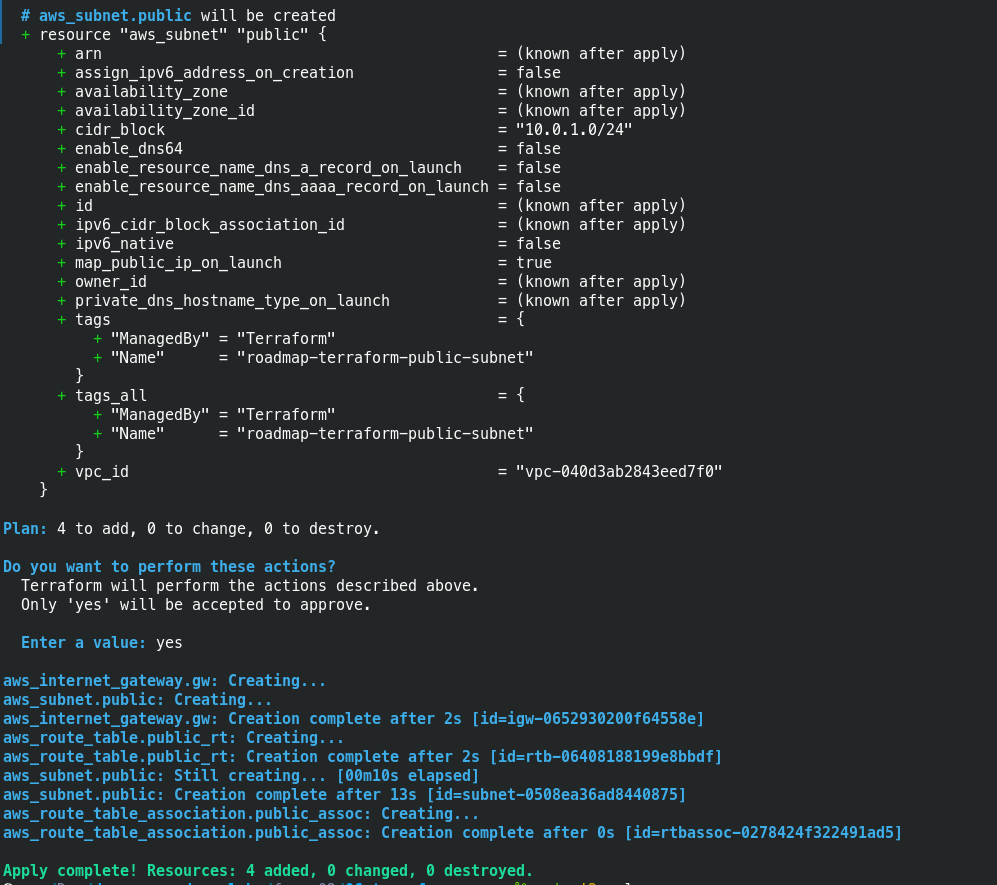
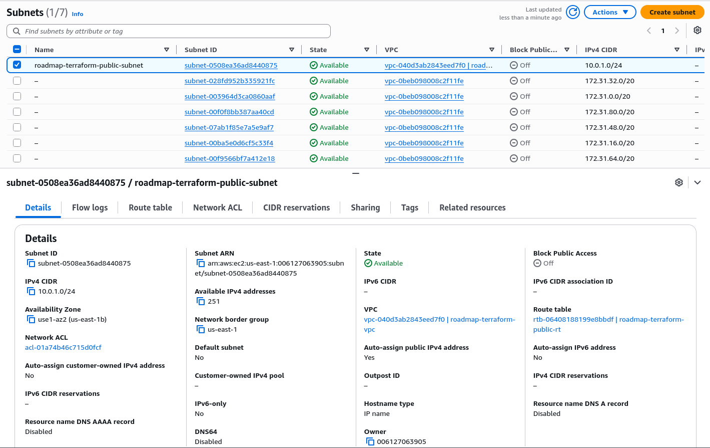

# Punto 06 Fase 02: Infraestructura como código con Terraform (AWS)

Este laboratorio contiene la automatización completa de una arquitectura base en AWS utilizando Terraform.

## Tecnologías utilizadas
- **Terraform** v1.x
- **AWS Provider** v5.x
- **Debian 13** como entorno de desarrollo local

## Hito 1: Configuración de Proveedor y Definición de Red Base

En este primer paso se configuraron los archivos estructurales (`providers.tf`, `variables.tf`) y se definió el ciclo de vida inicial.

- [x] **Seguridad en Git:** Configuración de `.gitignore` para evitar la filtración de archivos `.tfstate`.
- [x] **Variables Globales:** Modularización de la región (`us-east-1`) y el nombre del proyecto.
- [x] **Recursos Base:** Declaración de una VPC (`10.0.0.0/16`) y un Bucket S3 con nomenclatura única y etiquetas de auditoría (`ManagedBy = Terraform`).

### Evidencias de Inicialización
Aquí se observa la carga de credenciales mediante variables de entorno en Debian, la descarga exitosa de los plugins del proveedor de AWS, el plan de ejecución y el primer apply:

---

## Hito 2: Conectividad y Subred Pública

En esta etapa se segmentó la red virtual y se crearon los componentes necesarios para permitir la salida segura hacia internet, aplicando dependencias implícitas entre recursos.

- [x] **Internet Gateway (IGW):** Creación de la puerta de enlace lógica vinculada a la VPC para el tráfico exterior.
- [x] **Subred Pública:** Creación de una subnet (`10.0.1.0/24`) configurada con asignación automática de IP pública para las instancias.
- [x] **Tabla de Ruteo (Route Table):** Definición de la ruta por defecto (`0.0.0.0/0`) apuntando al Internet Gateway.
- [x] **Asociación de Rutas:** Vinculación de la subred pública con la nueva tabla de ruteo para activar el tránsito.

### Evidencias de Infraestructura de Red

