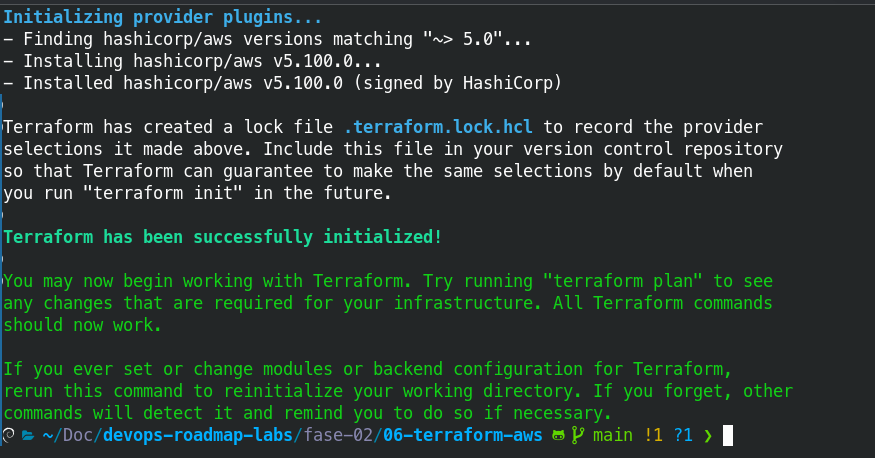
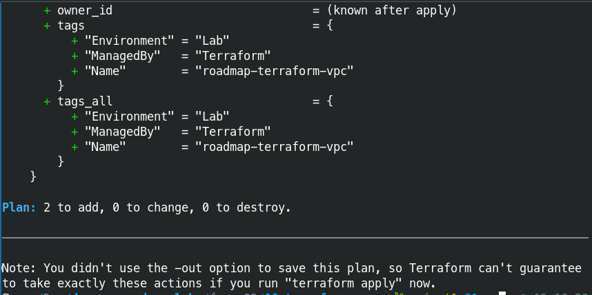
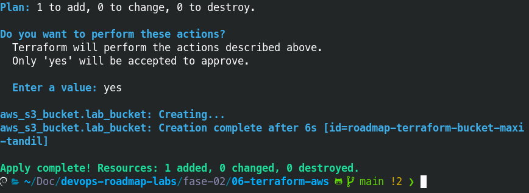
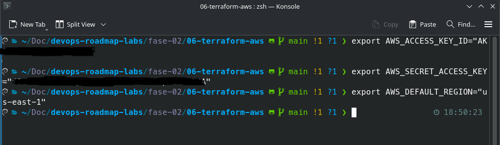

# Punto 06 Fase 02: Infraestructura como código con Terraform (AWS)

Este laboratorio contiene la automatización completa de una arquitectura base en AWS utilizando Terraform.

## Tecnologías utilizadas
- **Terraform** v1.x
- **AWS Provider** v5.x
- **Debian 13** como entorno de desarrollo local

## Hito 1: Configuración de Proveedor y Definición de Red Base

En este primer paso se configuraron los archivos estructurales (`providers.tf`, `variables.tf`) y se definió el ciclo de vida inicial.

- [] **Seguridad en Git:** Configuración de `.gitignore` para evitar la filtración de archivos `.tfstate`. 
- [] **Variables Globales:** Modularización de la región (`us-east-1`) y el nombre del proyecto.
- [] **Recursos Base:** Declaración de una VPC (`10.0.0.0/16`) y un Bucket S3 con nomenclatura única y etiquetas de auditoría (`ManagedBy = Terraform`).

### Evidencias de Inicialización
Aquí se observa la descarga exitosa de los plugins del proveedor de AWS, el plan de ejecución y el apply:

Además de los EXPORT de claves:

