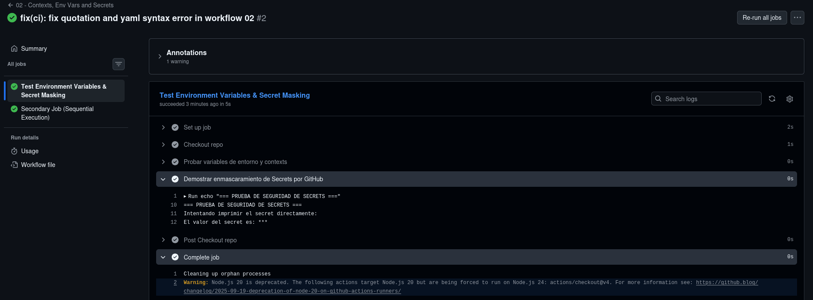
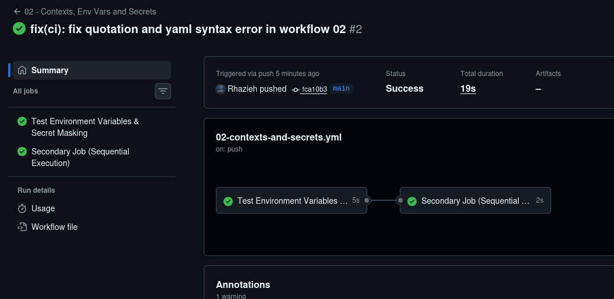

#MPunto 07 Fase 03: CI/CD con GitHub Actions

Este laboratorio documenta la práctica técnica e incremental para dominar **GitHub Actions** como motor de Integración Continua (CI) y Despliegue Continuo (CD) con un enfoque en **infraestructura, automatización y seguridad**.

---

## Objetivos del Módulo

* Entender la arquitectura básica de GitHub Actions: Workflows, Jobs, Steps y Runners.
* Filtrar ejecuciones por ruta (`paths`) y eventos Git (`push`, `pull_request`, `workflow_dispatch`).
* Administrar secretos encriptados (`Secrets`) y verificar su enmascaramiento en logs.
* Diseñar pipelines eficientes con ejecuciones secuenciales mediante dependencias (`needs`).
* Automatizar el build y empaquetado de contenedores Docker hacia **Docker Hub**.

---

## Progresión Práctica

### Bloque 1: Sintaxis YAML, Runners y Diagnóstico del Sistema
Se implementó el workflow `.github/workflows/01-infra-check.yml` para diagnosticar la máquina virtual efímera (Runner Linux) que asigna GitHub en cada ejecución.

* **Filtros por ruta:** Uso de `paths` para restringir el disparo del pipeline a cambios dentro de la carpeta del módulo o del archivo YAML correspondiente.
* **Inspección del Runner:** Validación del sistema operativo (Ubuntu 24.04 LTS), versión del Kernel (6.17) y presencia del motor de Docker (28.0.4).

---

### Bloque 2: Contextos, Variables de Entorno y Secrets
Se desarrolló `.github/workflows/02-contexts-and-secrets.yml` para evaluar la gestión segura de credenciales sensibles y el flujo de control entre trabajos.

* **Enmascaramiento de Secretos:** Configuración de un secret en el repositorio (`LAB_TEST_SECRET`) comprobando cómo GitHub sustituye su salida por `***` automáticamente en los logs de consola.
* **Encadenamiento de Jobs (`needs`):** Modelado de un grafo de ejecución donde un job secundario se ejecuta únicamente si el job principal finaliza exitosamente.

#### Evidencias Demostrables

*Figura 1: Enmascaramiento automático de credenciales sensibles (Secrets) en los logs de salida.*

*Figura 2: Ejecución secuencial y dependencia de trabajos definida mediante `needs`.*

---

##Herramientas Utilizadas

* **GitHub Actions** (Engine de automatización CI/CD)
* **Linux / Bash Scripting** (Diagnóstico del entorno y comandos de sistema)
* **Git & GitHub** (Triggers, Secrets, Workflows)
* **Docker & Docker Hub** (Próximo paso: Registry de imágenes)
